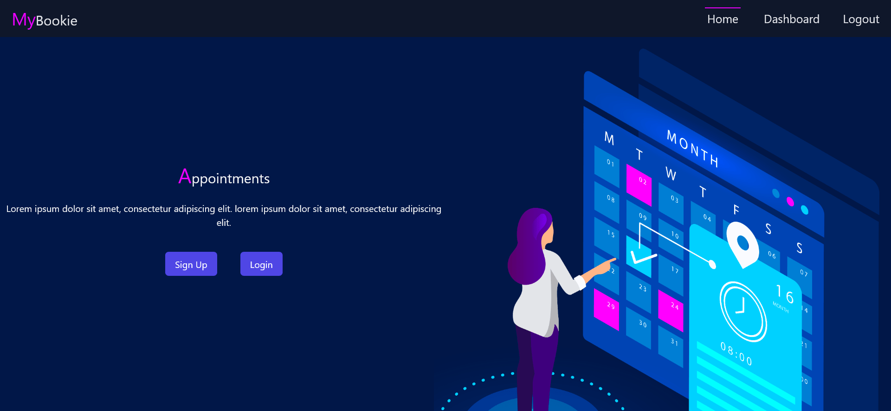

# MyBookie

## Coming Soon...



**MyBookie** is an appointment setter Full Stack Web Application Featuring:

Front End

- JWT
- React.js
- Tailwindcss

Back End

- JWT
- Bcrypt
- Python Flask Server
- PyMongo (MongoDB driver for Python)

## Installation

Currently, this project isn't configured as a Python package so manual installation of the installed packages is required

### Clone Repo

- HTTPS:
  - `git clone https://github.com/iiTONELOC/my-bookie.git`
- SSH:
  - `git clone git@github.com:iiTONELOC/my-bookie.git`
- GitHub Desktop:
  - [Open with GitHub Desktop](x-github-client://openRepo/https://github.com/iiTONELOC/my-bookie)

### Configure Python virtual env

The env runs `version = 3.10.2` and is the recommended Python version for your environment

- From the root of the project:

  ```shell
  py install_virt.py
  ```

- Activate the virtual environment

  On Windows:

  ```sh
  venv\Scripts\activate
  ```

- Run the run_install script from inside the virtual environment.  
  If the last command was successful, there should be a (venv) visible in the CLI

  ```shell
  py run_install.py
  ```

## Installing the Client

- The client uses React.js node.js and npm for the package manager
- If you do not have those already installed you can follow the directions in the links below:
  - [Node.js](https://nodejs.org/en/)
    - [NPM](https://docs.npmjs.com/cli/v8/configuring-npm/install) *comes with an installation of Node.js*
  - [React.js](https://reactjs.org/)
- From the virtual environment:

  ```shell
     py utils\install_client.py
  ```
  
## Generating the Client's build folder

- From the virtual environment:

  ```shell
     py utils\build_client.py
  ```

## Create Your .env File

- If you are trying to run this project locally you need a .env at the root of the project
- create a .env file at the root of your project and use the following variables:
  
   ```shell 
      ENV=development
      MONGO_DB_NAME=<enter the name of your database here>
   ```

## Running the Server

- Activate the virtual environment

  On Windows:

  ```shell
  venv\Scripts\activate
  ```

- Start Server

  ```shell
  py wsgi.py
  ```
